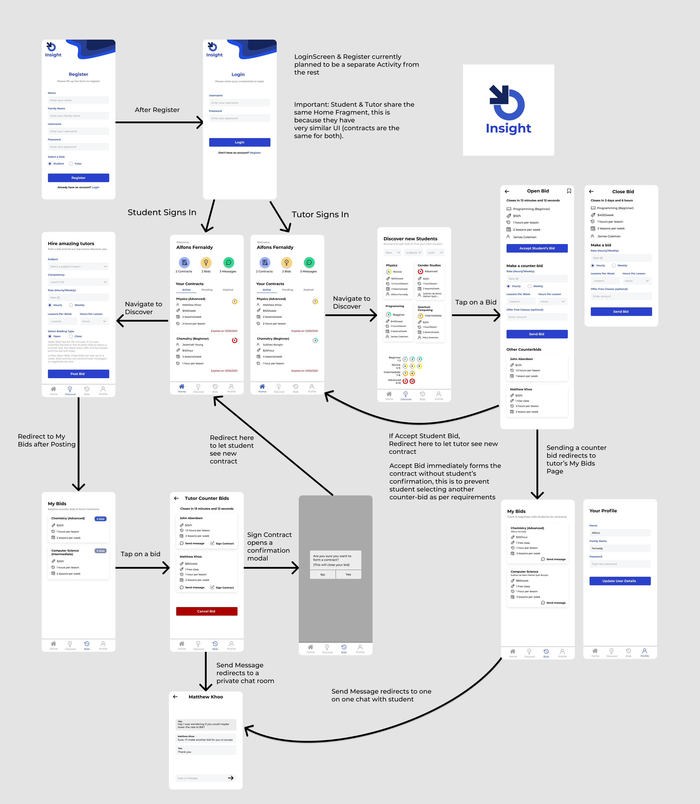

# Insight

  

## Installation
The app apk can be downloaded [here](https://github.com/ReduxLX/insight/releases/tag/v1.0) \
For the easiest experience, download and install the apk directly from an android device. \
You may use the following accounts to login (password is the same as username)
- Student Username: **neilly**
- Tutor Username: **brunella**

## About The Project
Insight represents the final submission for the FIT3077 Software Architecture unit. \
It is an android app which connects students to tutors namely through a bidding and contract formation process. \
Students post bids on the bid marketplace which describe terms like subject, subject difficulty, rate, schedule and contract length. \
Tutors meanwhile can browse the bid marketplace and either buyout these bids directly or send their own terms (counter-bidding). \
Students can accept the tutor's counter bids instead of waiting for a buyout. \
Once a bid is signed, a contract is formed between the student and tutor for the agreed duration of months.

The above core functionality is further enhanced by the implementation of the following features:
- Private Chatrooms between tutor and student
- Bid Bookmarking system
- Tutor Monitoring Dashboard showing involved and bookmarked bids
- Student Bid Dashboard to review tutor's counter bids
- Contract Renewal & Amendment process for expired contracts
- Notification system for close to expiry contracts

## Student & Tutor Demo

  

     
    
  

 

## UI Mockup in Figma

